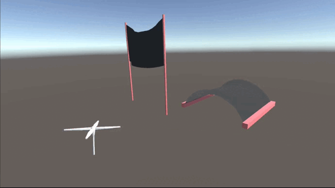
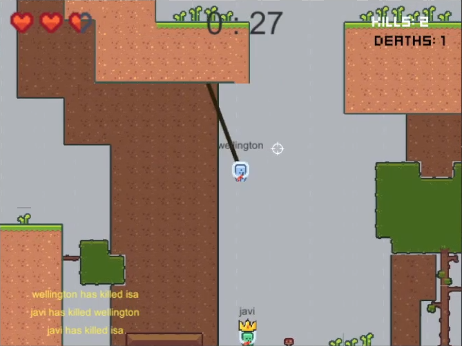
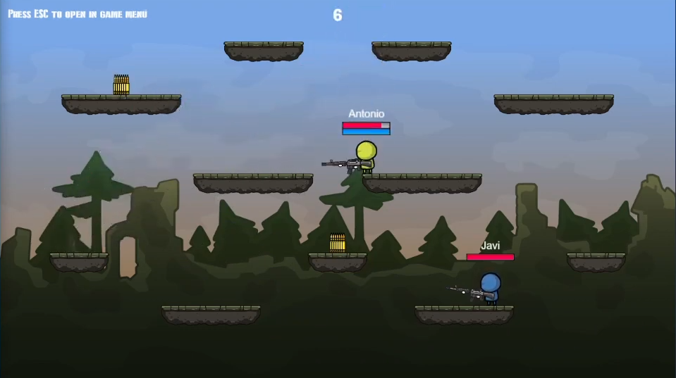
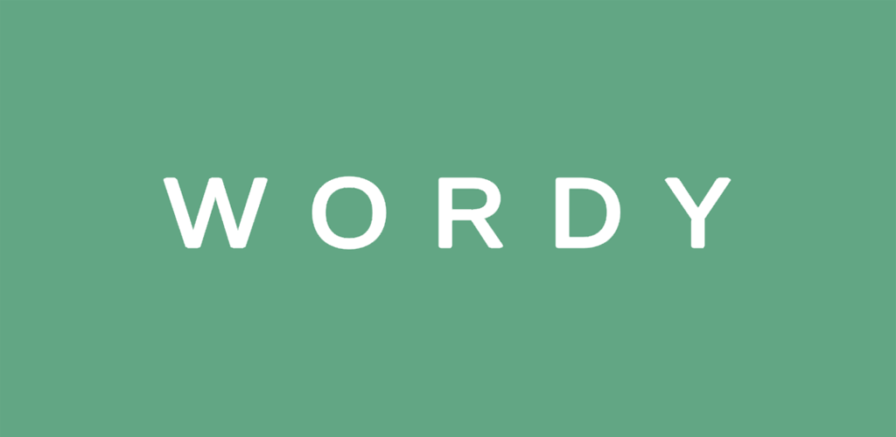
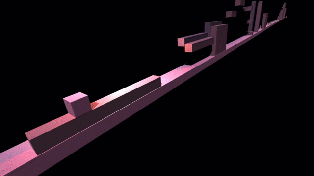

### Hi there 👋

I am Javi, a game development student who is mainly interested in the field of programming, either computer graphics or general videogame implementation, but always open minded for any new field or application.

This github will be a good looking one in a few days. Stay TUNED!!!

<h1 align="center">My Projects</h1>
<h2 align="center">My Top</h2>

  
  

 
<h2 align="center">Unity Tools</h2>

  
  
 

 
<h2 align="center">Multiplayer Games</h2>

  
  
 

 
<h2 align="center">Casual Games</h2>

  
  
 

 
