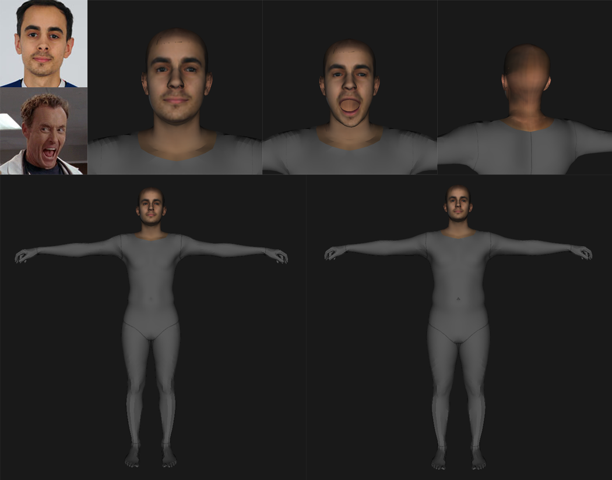

<h1 align="center">WELCOME</h1>

I am Javi, a game development student who is mainly interested in the field of programming, either computer graphics or general videogame implementation, but always open minded for any new field or application, and studying any thing comes to my mind. I'm about to start the last year of my studies and thinking on my thesis, which consist on achieving photorealism with neural networks. This summer I'm gonna study this field so I have a pretty good basis to start this project. Furthermore, I will try to code a game or develop another project. I also like reading so we can talk about books too. You can reach me here: 

<h2 align="center">MY WORK</h2>
<h2 align="center">Top</h2>

  
  
  
  

 
<h2 align="center">Unity Tools</h2>

  
  
 

 
<h2 align="center">Multiplayer Games</h2>

  
  
 

 
<h2 align="center">Casual Games</h2>

  
  
 

 
